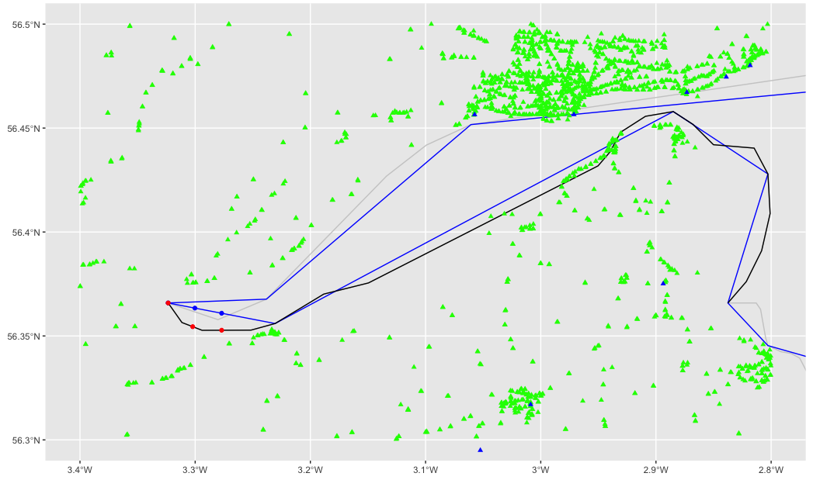

# coastalwalkr

<!-- badges: start -->
<!-- badges: end -->

`coastalwalkr` is another mapbot, inspired by Matt Dray's [`londonmapbot`](https://github.com/matt-dray/londonmapbot) and my [`narrowbotR`](https://github.com/mattkerlogue/narrowbotR). When up and running the `coastalwalkr` will take walks along the coast of Great Britain.

### TO DO
- [x] pull GB coastline from `{rnaturalearth}`
- [x] identify walking mechanism to follow coast in one direction, accounting for coastal geometry
- [x] create twitter account
- [ ] explore open data: nearest RLNI station, nearest public transport
- [ ] identify tweet strategy
- [ ] write script for tweeting
- [ ] write GH Action workflow for automation

#### Latest test plot

## Tweet strategy

Others in the mapbotverse select a position at random each time they tweeet. `londomapbot` generates a random latitude and longitude within a bounding box that contains the M25 and tweets an aerial photo of the location along with an OSM link. `narrowbotr` picks a random location from a list of canal features, it also searches flickr for photos close to the location, if no flickr photo is found it too uses an aerial photo of the location.

In developing a strategy for `coastalwalkr` the idea is to move beyond single unconnected tweets. The bot will start at a random location and then "walk" along the coast for a given number of tweets before starting a new walk at another location. While each tweet on a walk will be from a new location they will be near each other (e.g. 2-3 km) so unlike the other mapbots each tweet can contain different information. For example, along with the current location of the walk the different tweets on a walk might contain:

1. Tweet starting location with street map of the location
2. Tweet stating nearest public transport facilities
3. Tweet aerial photo of the current location
4. Tweet nearest bathing water quality information
5. Tweet some key statistics about the local area (population, age profile, employment rate)
6. Tweet nearest RNLI lifeboat
7. Tweet flickr photo
8. Tweet nearest non-GB location.
9. Tweet local MP/MSP/MS
10. Tweet distance from starting position

## Data investigations for the tweet strategy

#### Tweet 1: street map
Use Mapbox as per standard mapbots

#### Tweet 2: nearest public transport
Use [DfT NaPTAN/NPTG](https://naptan.app.dft.gov.uk) data/service.

- [x] download NaPTAN data
- [x] explore data
- [x] clean bus stop names
- [x] convert bus stops to {sf} object
- [x] convert railways to {sf} object
- [x] test plotting of bus/rail {sf} objects
- [ ] test nearest bus/rail selection
- [ ] build dataset of other transport facilities
- [ ] test nearest other transport selection

Test plot (starting at first point of Natural Earth GB coastline: 3.32346 West, 56.36586 North, mouth of the River Tay, SE of Perth):

- Natural Earth coatline in light grey
- Simplified coastline in blue (i.e. computational walking path)
- First 20 points of real coast (converted to line) in black
- Sequential points on computational path in blue
- Nearest real coastline points in red
- NaPTAN objects as triangles: bus stops in green, railway stations in blue

#### Tweet 3: aerial photo
Use Mapbox as per standard mapbots

#### Tweet 4: bathing water
The Environment Agency [Bathing Water Quality API](https://environment.data.gov.uk/bwq/) (for England) and Natural Resources Wales [Bathing Water Quality Data API](https://environment.data.gov.uk/wales/bathing-waters/) provide data for each country using a similar API format.

Raw data from the Scottish Environment Protection Agency appears to be [missing](https://www.environment.gov.scot/data/data-analysis/bathing-waters/), but some data is published on the web: (i) a table of location names and their rating [here](https://www2.sepa.org.uk/bathingwaters/Classifications.aspx); (ii) HTML profiles for individual locations [here](https://www2.sepa.org.uk/bathingwaters/Locations.aspx); and, (iii) more detailed PDF profiles [here](https://www2.sepa.org.uk/bathingwaters/Profiles.aspx)

#### Tweet 5: local statistics
The [NOMIS API](https://www.nomisweb.co.uk/) can provide access to a range of local statistics, for example population estimates, household composition, employment rate, regional income levels. For consistency and up-to-date data the local authority district level is the lowest available geography. This would also allow ability to link to authority website/twitter handle.

#### Tweet 6: Nearest RNLI lifeboat
The Royal National Lifeboat Institution is a charity that operates lifeboat and lifeguard services around the coasts of Great Britain, Ireland, the Isle of Man and Channel Islands. They publish a large amount of [open data](https://data-rnli.opendata.arcgis.com) about lifeboat stations, the lifeboat fleet and launches, and beaches with lifeguards.

#### Tweet 7: Flickr photo
Use Flickr API as per `narrowbotR`

#### Tweet 8: Nearest non-GB location
Use `sf::st_nearest_point()` to find nearest point on non-GB location. Consider excluding Scottish Islands?

#### Tweet 9: Local politicians
The UK Parliament's [open data service](https://explore.data.parliament.uk/?endpoint=members) provides data about MPs, including their twitter handles. Similarly the Scottish Parliament's [open data service](https://data.parliament.scot/#/datasets) also provides a variety of data about MSPs.

It is unclear if the Senedd's [open data services](https://senedd.wales/help/open-data/) includes details of MSs. It may be easier to collate a separate dataset by scraping the HTML pages/other sources.

#### Tweet 10: Distance travelled
Use `{sf}` to calculate the distance between start and end points, crow flies and along the coastline.